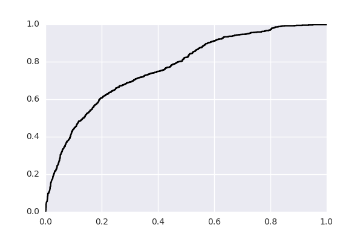
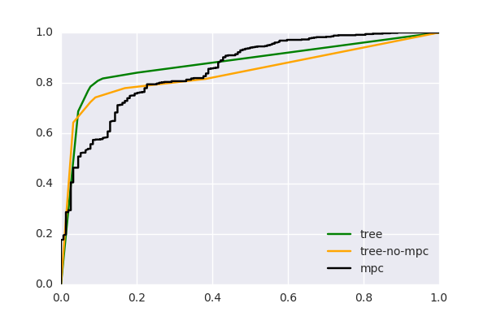

### Clinvar evaluation

Clinvar was downloaded February 2016. It has 10806 variants in 9234 positions. Positions were limited to those where all variants have the same clinical classification. 2350 positions have 2517 pathogenic or likely pathogenic variants, and 1997 positions have 2050 benign or likely benign variants. We focus on missense variants because those are the most difficult to classify. There are 1023 pathogenic missense positions with 1059 variants, and 518 benign missense positions with 523 variants.

934 missense pathogenic positions have 966 variants with MPC scores. MPC scores have not been computed for all transcripts yet, so some genes have no scores. The genes with the most missing clinvar variants are FOXG1, MECP2, and TSC2. 371 benign missense positions have 374 variants with MPC scores. First, we classify these positions using MPC.

627 pathogenic positions have 652 variants with MPC scores and reside in a Pfam domain. 154 benign positions have 154 variants with MPC scores and reside in a Pfam domain. Next we classify these variants using MPC, MPC+path-fraction, or path-fraction. This demonstrates that a combined MPC+path-fraction works better than either alone. The single MPC score performs bettter than the one shown earlier because the variant set is different. Here we just utilize missense variants in Pfam domains.

Now we include missense positions that are either inside a Pfam or have an MPC score. 994 pathogenic missense positions have 1029 variants. 393 benign missesne positions have 396 variants. We evaluate a modified classifier that allows for missing MPC scores and variants outside of Pfam domains.

Note that clinvar has not been limited by populaiton frequency.
